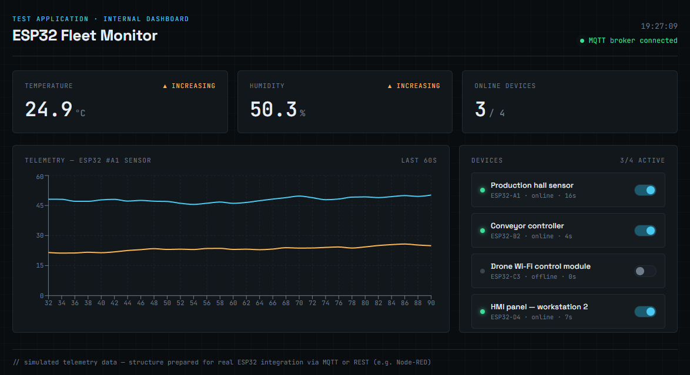

# ESP32 Fleet Monitor

## Live Demo

https://arkadiuszjaromin.github.io/esp32-fleet-monitor/

A React-based dashboard for monitoring and controlling IoT devices (ESP32).

The application simulates real-time telemetry data from sensors (temperature and humidity) and provides remote device control through an interactive dashboard. The project structure is prepared for integration with a real backend using MQTT, REST API, or Node-RED.

The project combines experience from industrial automation, SCADA/HMI systems, and modern frontend development.

## Preview



## Tech Stack

- React 18 + Vite
- Recharts (live telemetry charts)
- CSS (custom styling inspired by SCADA/HMI industrial interfaces)

## Running Locally

```bash
npm install
npm run dev
```

The application will start at: `http://localhost:5173`.

## Production Build

```bash
npm run build
npm run preview
```

## Project Structure

```
src/
  components/
    StatCard.jsx        -- karty ze statystykami (temp, wilgotność, liczba urządzeń online)
    TelemetryChart.jsx   -- wykres liniowy danych z czujnika w czasie
    DeviceList.jsx       -- lista urządzeń z przełącznikami on/off
  App.jsx                -- logika stanu i symulacji danych
  styles.css
```

## Planned Improvements

- Integration with real ESP32 devices using WebSocket or MQTT (e.g. Mosquitto / HiveMQ broker)
- Event history and alerts for threshold violations
- User authentication and multiple device fleets
- Storing telemetry history in a database (e.g. InfluxDB or MySQL)

---

## About This Project

This project was created as a portfolio application demonstrating the connection between industrial automation, ESP32 IoT systems, and modern React frontend development.
